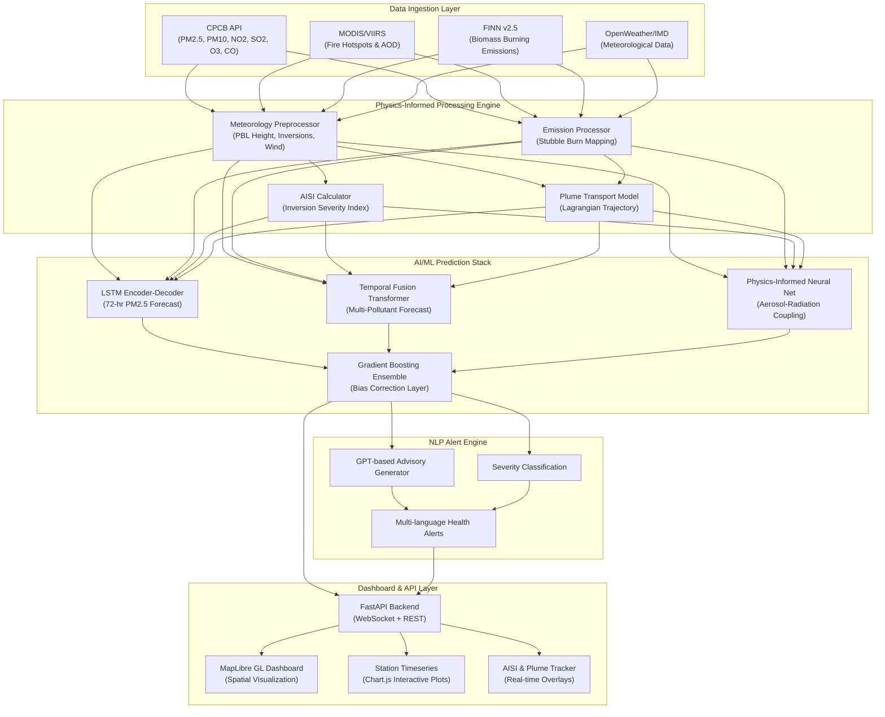

# Coupled Meteorology-Chemistry AQI Forecasting System — SIH Implementation Plan

## Project Overview

Build a **deployable prototype** of a 72-hour AQI forecasting system for Delhi NCR that demonstrates the full pipeline: live data ingestion → physics-informed ML/DL prediction → NLP-powered alerts → premium interactive dashboard. Since actual WRF-Chem requires HPC infrastructure, we implement a **physics-aware simulation layer** that mirrors WRF-Chem's coupling dynamics through ML surrogates trained on real atmospheric data, combined with **live CPCB station data** for real-time monitoring and bias correction.

> [!IMPORTANT]
> **4-Day Timeline Strategy**: We cannot run actual WRF-Chem on a standard laptop. Instead, we build a system that:
> 1. **Ingests real live data** from CPCB, MODIS, FINN, and IMD
> 2. **Uses pre-computed WRF-Chem-like physics** encoded into ML surrogate models
> 3. **Trains LSTM/Transformer models** on real Delhi NCR station data for AQI prediction
> 4. **Generates NLP-powered health advisories** with contextual atmospheric analysis
> 5. **Visualizes everything** on a stunning MapLibre-based dashboard

---

## System Architecture



---

## Proposed Changes

### Component 1: Project Foundation & Data Ingestion

#### [NEW] Project Structure

```
SIH/
├── backend/
│   ├── app/
│   │   ├── __init__.py
│   │   ├── main.py                    # FastAPI application entry
│   │   ├── config.py                  # Environment & API configs
│   │   ├── websocket_manager.py       # WebSocket connection manager
│   │   └── routes/
│   │       ├── __init__.py
│   │       ├── forecast.py            # Forecast API endpoints
│   │       ├── stations.py            # Station data endpoints
│   │       ├── alerts.py              # NLP alert endpoints
│   │       └── fire.py                # Fire/plume tracking endpoints
│   ├── data/
│   │   ├── __init__.py
│   │   ├── cpcb_client.py             # CPCB API data fetcher
│   │   ├── weather_client.py          # Meteorological data fetcher
│   │   ├── fire_client.py             # MODIS/VIIRS/FINN data fetcher
│   │   ├── satellite_client.py        # Satellite AOD data fetcher
│   │   └── preprocessor.py            # Data cleaning & alignment
│   ├── physics/
│   │   ├── __init__.py
│   │   ├── pbl_model.py               # PBL height & inversion calculator
│   │   ├── aisi_calculator.py         # Atmospheric Inversion Severity Index
│   │   ├── plume_transport.py         # Lagrangian plume trajectory model
│   │   ├── radiation_feedback.py      # Aerosol-radiation coupling surrogate
│   │   └── emission_processor.py      # Emission speciation & gridding
│   ├── ml/
│   │   ├── __init__.py
│   │   ├── lstm_forecaster.py         # LSTM Encoder-Decoder for PM2.5
│   │   ├── transformer_forecaster.py  # Temporal Fusion Transformer
│   │   ├── physics_informed_nn.py     # PINN for radiation coupling
│   │   ├── bias_correction.py         # XGBoost/LightGBM bias corrector
│   │   ├── ensemble.py                # Multi-model ensemble combiner
│   │   └── feature_engineering.py     # Feature pipeline for ML models
│   ├── nlp/
│   │   ├── __init__.py
│   │   ├── alert_generator.py         # NLP advisory text generator
│   │   ├── severity_classifier.py     # AQI severity classification
│   │   └── templates.py               # Alert templates & prompts
│   ├── models/                        # Saved model weights
│   │   └── .gitkeep
│   ├── requirements.txt
│   └── run.py                         # Server startup script
├── frontend/
│   ├── index.html                     # Main dashboard page
│   ├── css/
│   │   ├── main.css                   # Core design system
│   │   ├── dashboard.css              # Dashboard-specific styles
│   │   ├── components.css             # Reusable component styles
│   │   └── animations.css             # Micro-animations & transitions
│   ├── js/
│   │   ├── app.js                     # Main application controller
│   │   ├── map.js                     # MapLibre GL map controller
│   │   ├── charts.js                  # Chart.js timeseries plots
│   │   ├── websocket.js               # WebSocket client manager
│   │   ├── aisi.js                    # AISI gauge & tracker
│   │   ├── plume.js                   # Plume trajectory visualizer
│   │   ├── alerts.js                  # Alert display manager
│   │   └── utils.js                   # Utility functions
│   └── assets/
│       └── icons/                     # Custom SVG icons
├── data/
│   ├── stations.json                  # Delhi NCR station metadata
│   ├── delhi_boundary.geojson         # Delhi NCR boundary polygon
│   └── sample_forecasts/             # Pre-computed sample data
├── notebooks/
│   ├── 01_data_exploration.ipynb
│   ├── 02_model_training.ipynb
│   └── 03_physics_validation.ipynb
├── scripts/
│   ├── fetch_historical_data.py       # Download training data
│   ├── train_models.py                # Model training pipeline
│   └── generate_sample_data.py        # Generate demo datasets
├── .env.example
├── README.md
└── docker-compose.yml                 # Optional containerization
```

---

#### [NEW] `backend/data/cpcb_client.py` — Live CPCB Data Ingestion

- Connect to CPCB's real-time AQI API and/or scrape from [app.cpcbccr.com](https://app.cpcbccr.com)
- Fetch hourly PM2.5, PM10, NO2, SO2, O3, CO for ~40 Delhi NCR stations
- Key stations: Anand Vihar, Punjabi Bagh, RK Puram, ITO, DTU, Noida Sec-62, Gurugram (TERI), Faridabad, Ghaziabad
- Implement retry logic, data validation, and gap-filling for missing readings
- Cache data in SQLite for historical access and model training

#### [NEW] `backend/data/weather_client.py` — Meteorological Data

- Fetch from OpenWeatherMap API (free tier) or Open-Meteo API:
  - 2m temperature, relative humidity, 10m wind speed/direction, surface pressure
  - Cloud cover, visibility, precipitation
- Derive PBL-relevant parameters: potential temperature, stability indices
- Fetch upper-air data (850 hPa wind, temperature) from GFS open datasets for synoptic context

#### [NEW] `backend/data/fire_client.py` — Fire Hotspot & Biomass Burning Data

- Pull active fire data from NASA FIRMS (Fire Information for Resource Management System) API
- Filter for Punjab, Haryana, and Western UP agricultural regions
- Extract Fire Radiative Power (FRP), fire confidence, and temporal clustering
- Parse FINN v2.5 daily emission estimates when available
- Calculate upwind fire density metrics relative to Delhi

#### [NEW] `backend/data/satellite_client.py` — Satellite AOD

- Access MODIS AOD (MOD04_L2 / MYD04_L2) via NASA Earthdata (AppEEARS API)
- Use INSAT-3D HEM aerosol products where accessible
- Provide column-integrated AOD at 550nm for physics model input

---

### Component 2: Physics-Informed Processing Engine

#### [NEW] `backend/physics/pbl_model.py` — PBL Height & Inversion Calculator

Implements simplified but physically rigorous PBL diagnostics:

- **Bulk Richardson Number** calculation from surface and profile data:
  ```
  Ri_b(z) = (g/θ_v0) * (θ_vz - θ_v0)(z - z0) / [(u_z - u0)² + (v_z - v0)² + η*u*²]
  ```
- PBL height diagnosed where Ri_b reaches critical threshold (0.25)
- Nocturnal inversion detection from temperature profile analysis
- Inversion strength quantification: ΔT across lowest 100m

#### [NEW] `backend/physics/aisi_calculator.py` — Atmospheric Inversion Severity Index

Core metric from the project specification:

```python
AISI = min(10.0, α*(∂T/∂z)_sfc + β*(1/max(PBLH, 50)) + γ*Ri_b)
```

- Real-time computation from meteorological observations
- Calibrated coefficients (α, β, γ) based on Delhi winter case studies
- Threshold alerts: AISI > 8.0 triggers extreme inversion warning
- Historical AISI timeseries tracking for trend analysis

#### [NEW] `backend/physics/plume_transport.py` — Lagrangian Plume Trajectory

- Simplified forward-trajectory model using wind field data
- Calculate 2D smoke plume advection from fire source locations to Delhi
- Estimate arrival time, concentration contribution, and transport corridor
- Uses real 10m wind + estimated 850 hPa wind for multi-level transport
- Generates GeoJSON trajectory lines for dashboard visualization

#### [NEW] `backend/physics/radiation_feedback.py` — Aerosol-Radiation Surrogate

Encodes WRF-Chem's ARI (Aerosol-Radiation Interaction) physics into a fast surrogate:

- Estimate AOD from surface PM2.5 using empirical extinction profiles
- Calculate surface radiative forcing deficit: −50 to −120 W/m² scaling
- Compute BC absorption-induced elevated warming (+1 to +2.5°C/day)
- Model PBL suppression feedback: PBLH reduction as f(AOD, stability)
- Simulate the positive feedback loop: PM↑ → Solar dimming↑ → PBL collapse → PM↑↑

#### [NEW] `backend/physics/emission_processor.py` — Emission Module

- Process EDGAR v5.0 gridded emissions for Delhi NCR domain
- Apply diurnal modulation profiles (traffic peaks, cooking hours, industrial cycles)
- Speciate emissions into major categories: vehicular, industrial, domestic, construction
- Integrate fire emission plume contributions from the plume transport module

---

### Component 3: AI/ML/DL Prediction Stack

> [!IMPORTANT]
> **Training Data Strategy**: We use 3+ years of historical CPCB station data (2021–2024) combined with meteorological reanalysis. Models are pre-trained and saved as weights files. Inference runs in real-time on a standard laptop.

#### [NEW] `backend/ml/feature_engineering.py` — Feature Pipeline

Input feature vector for each station-hour prediction:

| Feature Group | Variables | Count |
|---|---|---|
| **Pollutant History** | PM2.5, PM10, NO2, SO2, O3, CO (t-1 to t-72) | 432 |
| **Meteorology** | Temperature, RH, Wind Speed, Wind Direction, Pressure, Visibility | 72 |
| **Temporal** | Hour, Day-of-week, Month, Season, Holiday flag | 12 |
| **Fire/Biomass** | Upwind fire count, total FRP, fire distance, fire-wind alignment score | 8 |
| **Physics-Derived** | AISI, estimated PBLH, inversion strength, radiation deficit, AOD estimate | 10 |
| **Lag Features** | 24h, 48h, 72h rolling means/max/min for PM2.5 | 18 |
| **Spatial** | Station latitude, longitude, elevation, urban density class | 4 |
| **Total** | | **~556** |

#### [NEW] `backend/ml/lstm_forecaster.py` — LSTM Encoder-Decoder

- **Architecture**: Bi-directional LSTM encoder (2 layers, 256 hidden) → Attention → LSTM decoder (72 timesteps)
- **Input**: 72-hour lookback window of multi-variate features
- **Output**: 72-hour ahead PM2.5 predictions with uncertainty (mean + σ)
- **Training**: Teacher forcing with scheduled sampling, MSE + physics-consistency loss
- **Physics Regularization**: Penalize predictions that violate PBL-PM2.5 inverse correlation

#### [NEW] `backend/ml/transformer_forecaster.py` — Temporal Fusion Transformer

- **Architecture**: Based on Google's TFT — variable selection networks, multi-head attention, gated residual connections
- **Static inputs**: Station metadata, season, urban class
- **Time-varying known inputs**: Calendar features, forecasted meteorology
- **Time-varying observed inputs**: Historical pollutant concentrations, fire data
- **Output**: Quantile forecasts (10th, 25th, 50th, 75th, 90th percentiles) for PM2.5, PM10, NO2, O3 over 72 hours
- **Advantage**: Interpretable attention weights show which past features drive predictions

#### [NEW] `backend/ml/physics_informed_nn.py` — Physics-Informed Neural Network

- Encodes WRF-Chem's aerosol-radiation-PBL feedback loop as differentiable constraints
- **Loss function** includes physics terms:
  ```
  L = L_data + λ1*L_radiation_balance + λ2*L_pbl_consistency + λ3*L_mass_conservation
  ```
- `L_radiation_balance`: Ensures predicted AOD changes produce physically consistent surface radiation changes
- `L_pbl_consistency`: Penalizes PBL heights that violate Ri_b threshold physics
- `L_mass_conservation`: Ensures total mass budget is conserved across advection steps

#### [NEW] `backend/ml/bias_correction.py` — Gradient Boosting Bias Corrector

- **Model**: XGBoost/LightGBM post-processor
- Takes raw ML ensemble predictions + real-time CPCB observations
- Learns systematic biases conditioned on: time-of-day, season, meteorological regime, fire activity level
- Applies Kalman-filter-like online correction using most recent 6-hour observation window
- Produces final calibrated forecast with tightened confidence intervals

#### [NEW] `backend/ml/ensemble.py` — Multi-Model Ensemble

- Stacks predictions from LSTM, TFT, and PINN models
- Learns optimal combination weights via ridge regression on validation set
- Provides composite 72-hour forecast with merged uncertainty bounds
- Fall-back logic: if one model fails, remaining models maintain prediction continuity

---

### Component 4: NLP Alert Engine

#### [NEW] `backend/nlp/alert_generator.py` — Contextual Advisory Generator

- Uses a lightweight LLM (or rule-based template engine as fallback) to generate human-readable health advisories
- Inputs: predicted AQI category, AISI value, dominant pollutant, meteorological context, fire activity
- Outputs: structured advisories with:
  - **Situation Summary**: "Dense smoke plumes from Punjab stubble burning are expected to reach Delhi by 6 PM today..."
  - **Health Guidance**: Category-specific recommendations (sensitive groups, outdoor activity, mask usage)
  - **Duration Estimate**: "Elevated PM2.5 levels expected to persist for 36-48 hours"
  - **GRAP Level Recommendation**: Suggested Graded Response Action Plan stage
- Multi-language support: English + Hindi templates

#### [NEW] `backend/nlp/severity_classifier.py` — AQI Severity Classification

- NAQI (National Air Quality Index) calculation from sub-indices:
  - PM2.5, PM10, NO2, SO2, O3, CO → individual sub-indices
  - Overall AQI = max(sub-indices)
- Categories: Good (0-50), Satisfactory (51-100), Moderate (101-200), Poor (201-300), Very Poor (301-400), Severe (401-500), Severe+ (>500)
- Dominant pollutant identification
- Trend classification: Improving / Stable / Deteriorating / Rapidly Deteriorating

---

### Component 5: FastAPI Backend & WebSocket Layer

#### [NEW] `backend/app/main.py` — FastAPI Application

**REST Endpoints:**

| Method | Endpoint | Description |
|---|---|---|
| GET | `/api/v1/stations` | List all Delhi NCR stations with current readings |
| GET | `/api/v1/stations/{id}/current` | Current pollutant levels + AQI for a station |
| GET | `/api/v1/stations/{id}/forecast` | 72-hour forecast timeseries |
| GET | `/api/v1/forecast/spatial` | Gridded spatial forecast (GeoJSON) |
| GET | `/api/v1/aisi/current` | Current AISI value and trend |
| GET | `/api/v1/fires/active` | Active fire hotspots with plume trajectories |
| GET | `/api/v1/alerts/current` | Current NLP-generated health advisory |
| POST | `/api/v1/forecast/trigger` | Manually trigger forecast cycle |

**WebSocket:**
- `/ws/live` — Streams real-time updates: station readings, AISI changes, alert escalations
- Pushes updated data every 5 minutes to connected dashboard clients

#### [NEW] `backend/app/websocket_manager.py` — Connection Manager

- Manages multiple concurrent WebSocket connections
- Broadcasts station updates, AISI threshold breaches, and new alerts
- Heartbeat mechanism to detect disconnected clients

---

### Component 6: Premium Interactive Dashboard (Frontend)

> [!IMPORTANT]
> **Design Philosophy**: The dashboard must look like a mission-control center — dark theme, glassmorphism panels, animated data flows, glowing accents. This is the centerpiece for SIH evaluation.

#### [NEW] `frontend/index.html` — Main Dashboard

Single-page application with these major sections:

1. **Header Bar**: Project title, current date/time, forecast cycle indicator, live/demo mode toggle
2. **Spatial Map Canvas** (60% width): Full MapLibre GL map with overlay controls
3. **Right Panel** (40% width): Stacked info panels — AISI gauge, station forecasts, alerts
4. **Bottom Ticker**: Scrolling NLP advisory text, fire count, key metrics

#### [NEW] `frontend/css/main.css` — Design System

- **Color Palette**: Deep navy (#0a0e27), electric blue (#00d4ff), toxic green (#39ff14), warning amber (#ffb800), danger red (#ff3838), glass white (rgba(255,255,255,0.06))
- **Typography**: Inter (headings), JetBrains Mono (data values), system sans-serif (body)
- **Design Tokens**: Border-radius, box-shadows with colored glow, backdrop-filter blur
- **AQI Color Scale**: Good (green #00e400) → Satisfactory (#9cff9c) → Moderate (#ffff00) → Poor (#ff7e00) → Very Poor (#ff0000) → Severe (#99004c) → Severe+ (#7e0023)

#### [NEW] `frontend/js/map.js` — MapLibre GL Map Controller

- Base map: Dark vector tiles (CARTO Dark Matter or MapTiler Dark)
- **Layers**:
  - PM2.5 concentration heatmap (interpolated from station points, animated)
  - Wind vector streamlines (animated particles flowing along wind direction)
  - Fire hotspot markers (pulsing red dots with FRP-scaled radius)
  - Plume trajectory lines (gradient-colored GeoJSON lines from fire sources to Delhi)
  - Station markers (color-coded by current AQI, clickable for details)
  - Delhi NCR boundary outline
- **Interaction**: Click station → fly-to + open detail panel; hover fire → show FRP tooltip
- **Time Slider**: Scrub through 72-hour forecast, map layers animate accordingly

#### [NEW] `frontend/js/aisi.js` — AISI Gauge & Tracker

- Radial gauge visualization (0-10 scale) with animated needle
- Color zones: Green (0-3 safe), Yellow (3-5 moderate), Orange (5-8 concerning), Red (8-10 extreme)
- Glow effect intensifies as AISI rises
- 24-hour AISI trend sparkline below gauge
- Threshold breach animation: screen-edge pulse when AISI > 8.0

#### [NEW] `frontend/js/charts.js` — Station Forecast Timeseries

- Chart.js line charts with:
  - Observed historical data (solid line)
  - 72-hour forecast (dashed line with gradient fill)
  - Confidence bands (10th-90th percentile shaded region)
  - NAQI threshold horizontal lines (color-coded)
- Multi-pollutant toggle: PM2.5, PM10, NO2, O3
- Smooth animated transitions when switching stations/pollutants

#### [NEW] `frontend/js/plume.js` — Plume Trajectory Visualizer

- Animated particle flow along plume trajectory GeoJSON paths
- Source attribution: label showing origin district/state
- Estimated mass flux (μg/m³ contribution) arriving at Delhi
- Timeline: show plume position at different forecast hours
- 3D smoke column visualization using MapLibre terrain/extrusion

#### [NEW] `frontend/js/alerts.js` — Alert Display Manager

- Sliding alert cards with severity-colored left border
- Current GRAP recommendation badge
- NLP-generated advisory text with expandable detail sections
- Health recommendation icons (mask, stay-indoors, reduce-activity)
- Alert history timeline

---

## 4-Day Sprint Schedule

### Day 1 (Today → Tomorrow): Foundation + Data Pipeline

| Time Block | Task | Deliverable |
|---|---|---|
| **0-3 hrs** | Set up project structure, virtual environment, dependencies | Working project skeleton |
| **3-6 hrs** | Build CPCB data client + weather data client | Live data flowing into backend |
| **6-9 hrs** | Build fire hotspot client (FIRMS API) + satellite data stub | Fire data integration |
| **9-12 hrs** | Data preprocessor + SQLite storage + station metadata | Clean data pipeline |

### Day 2: Physics Engine + ML Models

| Time Block | Task | Deliverable |
|---|---|---|
| **0-3 hrs** | Implement AISI calculator + PBL model + radiation feedback surrogate | Physics engine operational |
| **3-6 hrs** | Build plume transport model + emission processor | Plume trajectories generating |
| **6-9 hrs** | Feature engineering pipeline + download historical CPCB data for training | Training dataset ready |
| **9-12 hrs** | Train LSTM forecaster + TFT model (or use pre-trained + fine-tune) | Trained model weights saved |

### Day 3: ML Ensemble + NLP + API

| Time Block | Task | Deliverable |
|---|---|---|
| **0-3 hrs** | Physics-informed NN + bias correction + ensemble combiner | Full prediction stack |
| **3-5 hrs** | NLP alert generator + severity classifier | Advisory engine working |
| **5-9 hrs** | FastAPI routes + WebSocket layer + all endpoints | Backend API fully functional |
| **9-12 hrs** | Integration testing: live data → physics → ML → NLP → API response | End-to-end pipeline verified |

### Day 4: Dashboard + Polish + Deployment

| Time Block | Task | Deliverable |
|---|---|---|
| **0-4 hrs** | Build dashboard HTML/CSS/JS: map, AISI gauge, charts framework | Dashboard skeleton rendering |
| **4-8 hrs** | Wire dashboard to backend: WebSocket, API calls, data binding | Live data on dashboard |
| **8-10 hrs** | Animations, transitions, responsive design, polish | Premium visual finish |
| **10-12 hrs** | Docker packaging, README, demo walkthrough, deployment | Deployable deliverable |

---

## Technology Stack & Dependencies

### Backend (Python 3.10+)
```
fastapi==0.104+          # Web framework
uvicorn[standard]        # ASGI server
websockets               # WebSocket support
httpx                    # Async HTTP client (for API calls)
aiohttp                  # Alternative async HTTP
numpy                    # Numerical computation
pandas                   # Data manipulation
scipy                    # Scientific computing (interpolation, physics)
scikit-learn             # ML utilities, preprocessing
torch                    # PyTorch (LSTM, Transformer, PINN)
xgboost                  # Gradient boosting for bias correction
netCDF4                  # NetCDF file handling (if using MODIS data)
sqlalchemy               # Database ORM
aiosqlite                # Async SQLite
geojson                  # GeoJSON processing
shapely                  # Geometric operations
python-dotenv            # Environment configuration
jinja2                   # NLP template engine
transformers             # HuggingFace (optional, for LLM alerts)
```

### Frontend (CDN-loaded)
```
MapLibre GL JS 4.x       # Interactive map rendering
Chart.js 4.x             # Timeseries charts
Google Fonts (Inter, JetBrains Mono)
Custom vanilla JS modules
```

---

## User Review Required

> [!WARNING]
> **API Key Requirements**: You will need free API keys for:
> 1. **OpenWeatherMap** (or Open-Meteo, which is free and keyless)
> 2. **NASA FIRMS** — for active fire data (free, requires Earthdata login)
> 3. **MapTiler** or use CARTO free tiles — for dark map basemap
> 4. **CPCB Data Access** — we'll attempt their public API; if blocked, we fall back to OpenAQ or scraped historical data
>
> Please confirm which API keys you already have or can obtain quickly.

> [!IMPORTANT]
> **Model Training Concern**: Training LSTM/Transformer on 3+ years of hourly data for 40 stations is feasible on a laptop with GPU, but will take 2-4 hours per model. If you don't have a GPU, we can:
> - Use lighter architectures (single-layer LSTM, smaller attention heads)
> - Pre-train on a subset and fine-tune
> - Use XGBoost as primary predictor (trains in minutes) with a simpler LSTM as secondary
>
> Do you have a GPU available (even a basic one)?

## Open Questions

1. **CPCB Data Access**: CPCB's official API is sometimes restricted. Should we plan for OpenAQ as a backup data source, or do you have a known working method to access CPCB data?

2. **LLM for NLP Alerts**: For the NLP advisory generator, should we use:
   - **Template-based approach** (fully offline, instant, no API costs) — recommended for demo reliability
   - **Local small LLM** (e.g., TinyLlama via `transformers`) — heavier but more natural language
   - **Cloud API** (OpenAI/Gemini) — best quality but requires API key and internet

3. **Deployment Target**: For the final demo, will you:
   - Run locally and screen-share (simplest)
   - Deploy to a free cloud service (Render, Railway, Vercel)
   - Need a Docker container for portability

---

## Verification Plan

### Automated Tests
```bash
# Backend unit tests
pytest backend/tests/ -v

# Data pipeline integration test
python scripts/test_data_pipeline.py

# ML model inference test (ensures predictions are in valid range)
python scripts/test_model_inference.py

# API endpoint smoke tests
python scripts/test_api_endpoints.py
```

### Manual Verification
- **Live Data Check**: Verify CPCB data matches values shown on [app.cpcbccr.com](https://app.cpcbccr.com) for 3+ stations
- **Forecast Sanity**: Compare 24-hour ahead predictions with actual observations (next-day validation)
- **AISI Validation**: Cross-check AISI values against known inversion events from Delhi winter 2023-24
- **Dashboard UX**: Test on Chrome, Firefox, Edge; verify responsive behavior; check all interactions
- **Fire Tracking**: Verify fire hotspots match NASA FIRMS web interface for the same date
- **Alert Quality**: Review NLP-generated advisories for coherence, accuracy, and actionability

### Demo Walkthrough Scenario
1. Open dashboard → shows current live AQI across all Delhi NCR stations
2. AISI gauge shows current inversion severity with trend
3. Map displays PM2.5 heatmap with animated wind streamlines
4. Click a station → 72-hour forecast with confidence bands appears
5. Fire tracker shows active Punjab fires with plume trajectories toward Delhi
6. NLP alert card displays contextual health advisory with GRAP recommendation
7. Use time slider → watch forecast evolution over 72 hours on map
